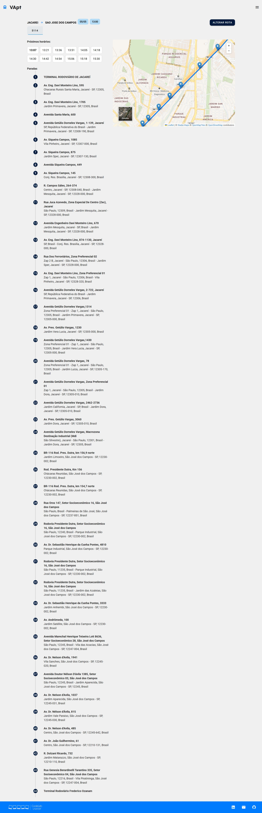

# **VApt**

## **Objetivo**

O projeto VApt tem como objetivo melhorar a adequação do transporte público para usuários com deficiência por meio de análise e classificação dos dados de buscas realizadas pelos usuários.

- ### *Gerais:*

  - Promoção de maior acessibilidade e autonomia para pessoas com deficiência no transporte público intermunicipal;

  - Fornecimento de dados estruturados para tomada de decisão e melhorias no serviço.

- ### *Específicos:*
  - Coleta e classificação de demandas dos usuários com deficiência;

  - Identificação de padrões de uso e gargalos no atendimento;

  - Facilitar o acesso à informação sobre linhas e condições de acessibilidade;

  - Proposição de melhorias com base em evidências extraídas dos dados coletados.

## **Público Alvo**

Usuários com deficiência que utilizam o transporte público intermunicipal, especialmente no estado de São Paulo

## **Tecnologias Utilizadas**

- **Front-end:** Vue, Vuex, Jest

- **Modelagem de UI:** Figma

- **Back-end:** TypeScript, PostgreSQL

- **Orquestração de deploy:** Docker, GitHub Actions

## **Como Rodar o Projeto:**

- ### **Requisitos**:

  - [node](https://nodejs.org/en)

  - [git](https://git-scm.com/)

- ### **Clone o repositório**:

  - CodeLab Loader: https://github.com/UnifespCodeLab/codelab-loader

- ### **Em seguida, clone estes repositórios dentro das pastas vazias do Loader**:

  - **Front-end:** https://github.com/UnifespCodeLab/emtu-web

  - **Back-end:** https://github.com/UnifespCodeLab/emtu-api

- ### Setup das envs: 

  - Execute ./boot.sh (este passo é obrigatório)

  - (Serão criadas todas as envs baseadas no .env.sample de cada service)

- ### Configure o Ambiente:
  - Tenha Docker instalado

  - Na raiz do projeto execute os comandos:
``docker compose up nome_do_service`` (exemplo: ``docker compose up emtu-web`` para subir o container do emtu-web, faça a mesma coisa substituindo por emtu-api e ``docker compose up postgres`` para o banco de dados)

- ### O docker começará a construir os containers de cada parte (o que deverá criar instâncias locais):
  - Acesso padrão para o front-end em http://localhost:3000

  - Acesso padrão para a API em http://localhost:3333

- ### Documentação mais detalhada (com formas alternativas de rodar) está disponível nos READMEs de cada repositório:
  - https://github.com/UnifespCodeLab/codelab-loader

  - https://github.com/UnifespCodeLab/emtu-api

- ### Para mais detalhes confira a [doc](https://nuxtjs.org) do nuxt.

## **Protótipo**

[Link do figma](https://www.figma.com/design/MY9TVu5Y4G94IdIafPZB5d/Redesenho-EMTU%2FVApt?node-id=420-436&p=f&t=eIvQQTEjAMbaNI6P-0)

## **Fluxo de desenvolvimento**

- (opcional) Dê uma olhada em como funcionam os [conventional commits](https://www.conventionalcommits.org/en/v1.0.0/)

- Vá até o board do github e encontre o [_emtu-web_](https://github.com/orgs/UnifespCodeLab/projects/15/views/1)

- Encontre a issue desejada

- Atribua a si mesmo

- Mude para a coluna _In Progress_

- Com o projeto já clonado em sua pasta desejada, crie uma branch baseada no que está fazendo. Por exemplo:
  - `git checkout -b issue-10`

- Uma boa prática é sempre deixar seus commits o mais '_atômicos_' possível

- Quando todo o desenvolvimento estiver finalizado abra um [pull request](https://github.com/UnifespCodeLab/emtu-api/compare). Lembrando precisa ser nesse sentido: `base: main` <- `compare: issue-10`

- Marque os revisores para que os mesmos recebam notificação e revisem o seu pr

- Vincule a issue aberta com o seu pr

- Corra pro abraço

## **Imagens do Protótipo**

*Tela inicial - desktop*

*Tela de rotas - desktop*

*"Não encontrei minha rota"*

*Tela inicial - mobile*

*Sobre o projeto*

## **Troubleshooting**

- Versão do `node`:
  - Utilizando versões acima da <b>16</b> é possível que o erro `ERR_OSSL_EVP_UNSUPPORTED` apareça em sua tela. Como solução é possível passar uma _env_ que fará com que o projeto utilize a versão legado do _ssl provider_:
  - Em seu terminal execute: `export NODE_OPTIONS=--openssl-legacy-provider` (Linux) ou `$env:NODE_OPTIONS="--openssl-legacy-provider"` (Windows)

## **Status**

- [ ]  Em ideação
- [x]  Em desenvolvimento
- [ ]  Testando com usuário
- [ ]  Em uso
- [ ]  Descontinuado
